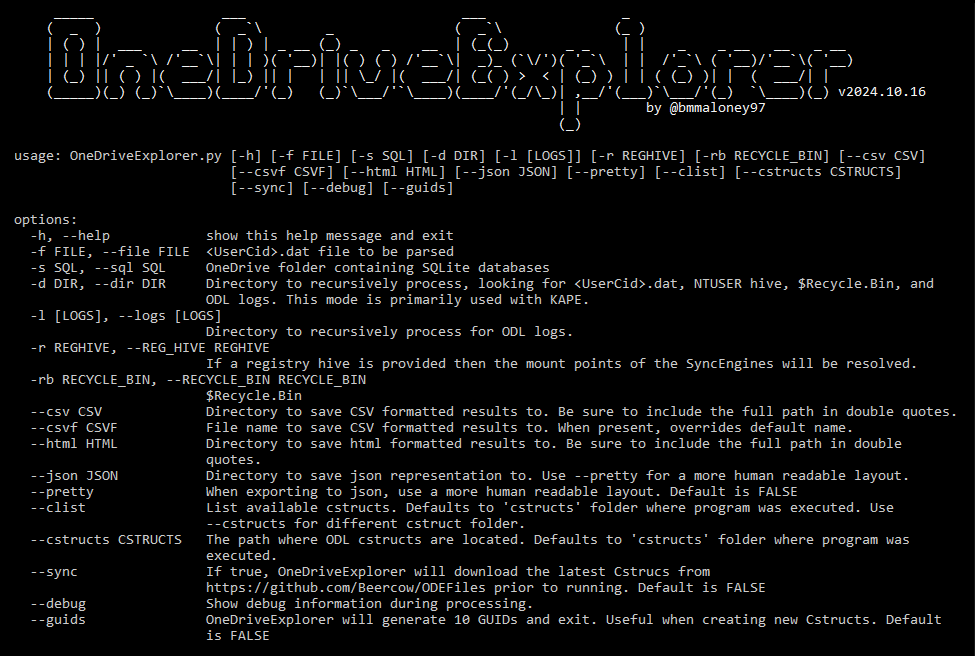
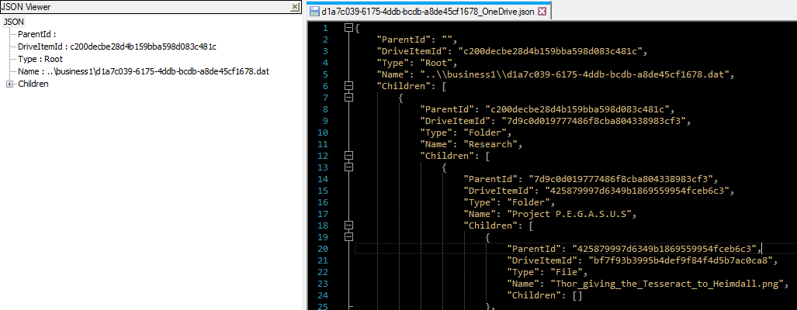
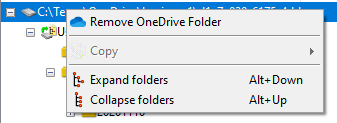
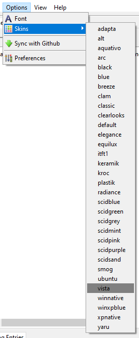

# OneDriveExplorer Summary

OneDriveExplorer is a command line and GUI based application for reconstructing the folder structure of OneDrive from the `<UserCid>.dat` and `<UserCid>.dat.previous` file.

## Usage

**Note:** ode.settings file will need to be deleted when running new builds

## Requirements

This project requires several additiona modules. You can install them with the provided requirements.txt file as follows:

```bash
pip3 install -r requirements.txt
```

## Command line



To use OneDriveExporer, simply provide the `.\<UserCid>.dat` file to the `-f` argument

```bash
OneDriveExplorer.py -f business1\d1a7c039-6175-4ddb-bcdb-a8de45cf1678.dat
```

Depending on the options, OneDriveExplorer can produce JSON, CSV, or HTML files of the parsed data. The `--pretty` option can be used to output the JSON into a more human readable layout.

Additionaly, a user registry hive can be supplied with the `-r` argument. This will resolve some of the mount points associated with OneDrive.

### Example output:

#### JSON



#### CVS


#### HTML


## GUI

The GUI consists of two panes: the folder structure on the left and details on the right. By clicking on one of the entries in the left pane, the details pane will populate with various data such as name, whether it is a file or folder, UUIDs and the number of children, if any.


The GUI is capable of parsing dat files along with loading JSON or CSV from a previously parsed dat file. OneDriveExplorer GUI also supports loading multiple files. When loading a dat file, an additional dialog will appear to allow you to supply a registry file. This can be disabled by holding down `SHIFT` or disabling it in the preferences menu.

  

Through the preferences menu, there are options avaiable for saving the parsed dat file to JSON, CSV, and HTML. There is also an option to disable the hive dialog.

 

OneDriveExplorer GUI is also capable of performing a simple search.


There are right click menus to help perform various tasks and sin options.






The messages dialog can be accessed by double clicking on the number in the lower right corner. From this dialog, you can view, clear and export debug messages. 


## File location

The default file location of the `.dat` files are:

- Personal: `C:\Users\<USERNAME>\AppData\Local\Microsoft\OneDrive\settings\Personal\<UserCid.dat>`
- Business: `C:\Users\<USERNAME>\AppData\Local\Microsoft\OneDrive\settings\Business1\<UserCid.dat>`

## Todo

- [x] Add support for OneDrive personal
- [x] GUI not populating correctly when opening different dat file
- [x] Load multiple files in GUI
- [x] Performance improvements
- [ ] Set minimum width on slider left/right
- [ ] Get file/folder count when parsing json
