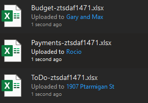
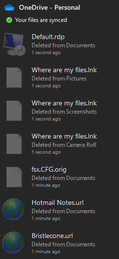

Will not run in WSL .. must use windows

Created a dev branch

commented out lot of the pre-reqs from requirements.txt. Planning to only run the non-GUI version with sqlLite database

Copied SafeDelete.db and SyncEngineDatabase.db from `\\ztsdaf1471\C:\Users\sween\AppData\Local\Microsoft\OneDrive\settings\Personal"` to tmp/Personal

```powershell
$env:Path = "C:\Users\1010035\.local\bin;$env:Path"
uv venv .venv_win
.venv_win\Scripts\activate
uv pip install -r OneDriveExplorer/requirements.txt

# https://www.sqlite.org/c3ref/open.html#urifilenameexamples
python .\OneDriveExplorer\OneDriveExplorer.py -s //C:/D/code/OneDriveExplorer/tmp/Personal --csv tmp/Personal
# :
# 82302 files(s) - 0 deleted, 5468 folder(s) in 29.0113 seconds
# Creates output file tmp\Personal\SQLite_DB_OneDrive.csv
```



