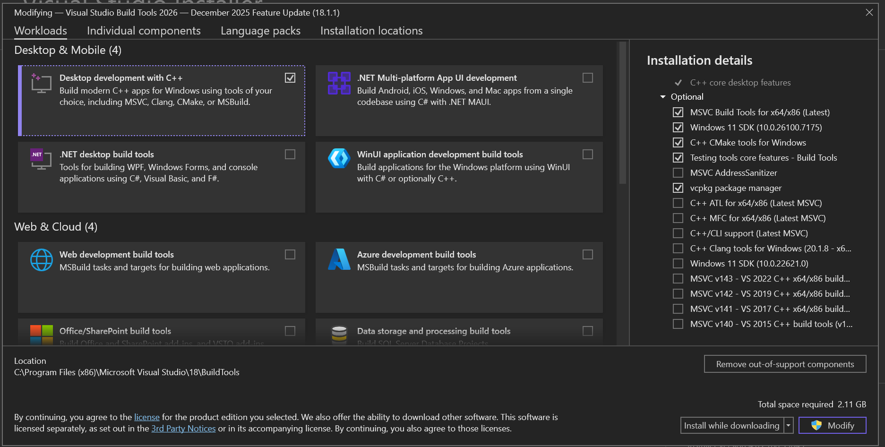
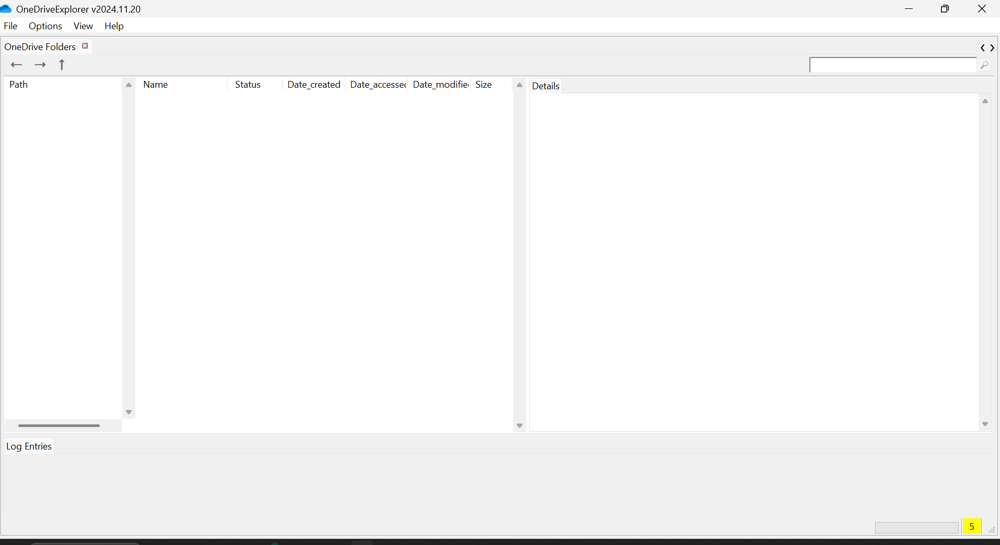
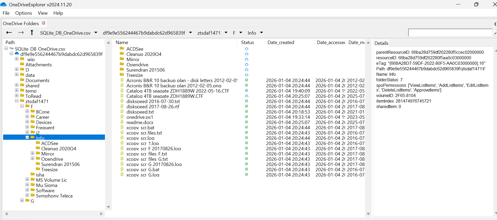
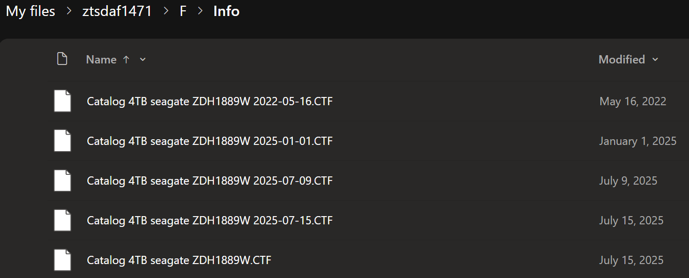

# Using OneDriveExplorer

Will not run in WSL .. must use windows

Created a dev branch

commented out lot of the pre-reqs from requirements.txt. Planning to only run the non-GUI version with sqlLite database

Copied SafeDelete.db and SyncEngineDatabase.db from `\\ztsdaf1471\C:\Users\sween\AppData\Local\Microsoft\OneDrive\settings\Personal"` to tmp/Personal

```powershell
$env:Path = "C:\Users\1010035\.local\bin;$env:Path"
uv venv .venv_win
.venv_win\Scripts\activate
uv pip install -r OneDriveExplorer/requirements.txt

# https://www.sqlite.org/c3ref/open.html#urifilenameexamples
python .\OneDriveExplorer\OneDriveExplorer.py -s //C:/D/code/OneDriveExplorer/tmp/Personal --csv tmp/Personal
# :
# 82302 files(s) - 0 deleted, 5468 folder(s) in 29.0113 seconds
# Creates output file tmp\Personal\SQLite_DB_OneDrive.csv
```


# Using ProcMon
Ran sysinternals/ProcMon64.exe with following filter

[assets/ProcMon/OneDrive_3.PMF](assets/ProcMon/OneDrive_3.PMF)


data was exported as csv

Nothing really analyzable here yet.


# Installing tkinter
```bash
source .venv/bin/activate
sudo apt-get install python3-tk
python
# Python 3.12.3 (main, Jun 18 2025, 17:59:45) [GCC 13.3.0] on linux
# Type "help", "copyright", "credits" or "license" for more information.
# >>> import tkinter
# >>> quit()
```

# Activating GUI version

Install Microsoft Build Tools : https://visualstudio.microsoft.com/visual-cpp-build-tools/

Install:
- Visual Studio Build Tools
- Include:
    - “Desktop development with C++”
    - Windows SDK
    - MSVC toolset

SDK required as other may get errors like "Cannot open include file: 'io.h'"


unchecked everything on the right except teh following


Using powershell as Git Bash is too slow
```powershell
cd C:\D\code\OneDriveExplorer
.venv_win\Scripts\activate
uv pip install -r OneDriveExplorer\requirements.txt
which python3 
# /c/Users/1010035/AppData/Local/Microsoft/WindowsApps/python3
which python 
# /c/D/code/OneDriveExplorer/.venv_win/Scripts/python
# Don't use python3

# Copy OneDrive *.db files from source systme (ztsdaf1471)

python .\OneDriveExplorer\OneDriveExplorer.py -s //c:/D/code/OneDriveExplorer/tmp/ztsdaf1471/OneDrive_260104 --csv tmp
# C:\D\code\OneDriveExplorer\OneDriveExplorer\OneDriveExplorer.py:217: SyntaxWarning: invalid escape sequence '\ '
#   print('Error: Remove trailing \ from directory.\nExample: --json "c:\\temp" ')
# C:\D\code\OneDriveExplorer\OneDriveExplorer\OneDriveExplorer.py:225: SyntaxWarning: invalid escape sequence '\ '
#   print('Error: Remove trailing \ from directory.\nExample: --csv "c:\\temp" ')
# C:\D\code\OneDriveExplorer\OneDriveExplorer\OneDriveExplorer.py:233: SyntaxWarning: invalid escape sequence '\ '
#   print('Error: Remove trailing \ from directory.\nExample: --html "c:\\temp" ')
# :
# :
# Saving OneDrive data. Please wait.... -
# 21074 files(s) - 0 deleted, 2990 folder(s) in 4.6977 seconds

#
# Creates tmp\SQLite_DB_OneDrive.csv

python .\OneDriveExplorer\OneDriveExplorer_GUI.py
```


File -> OneDrive Settungs -> Import CSV

Import the csv created above



Note that CTF and Treesize from  2025-07-15 & 2026-01-04 are not showing up but OneDrive Online shows 2025-07-15



Need to investigate what is happening to OneDrive on the PC