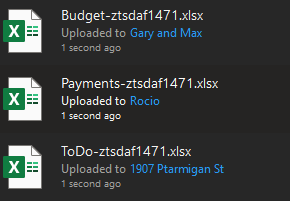
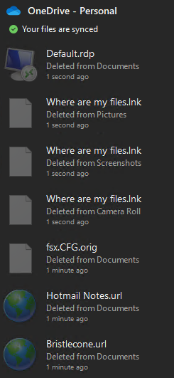
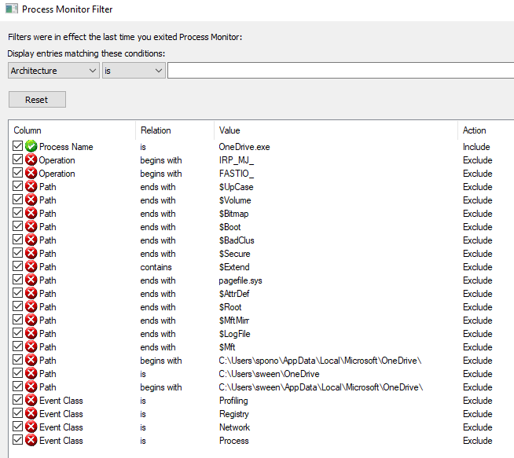
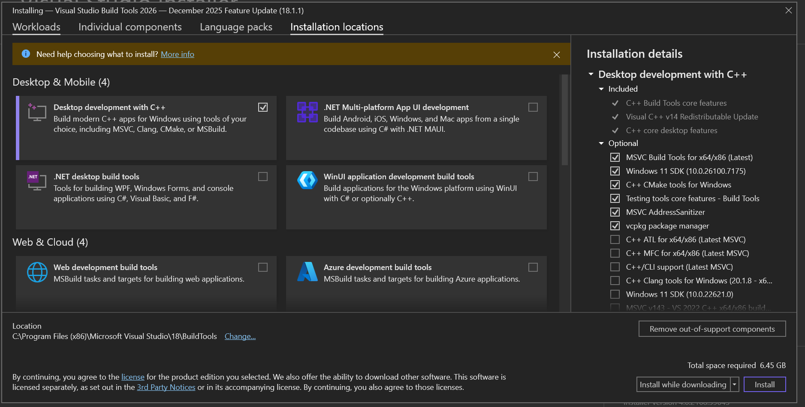
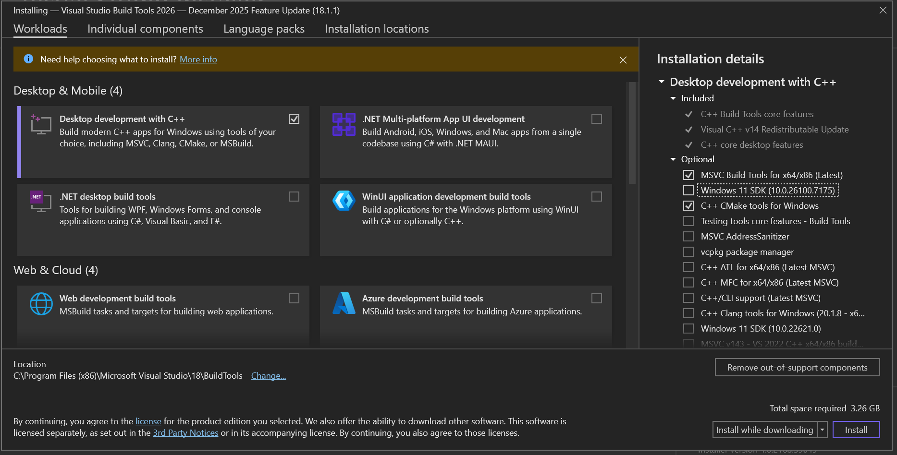

# Using OneDriveExplorer

Will not run in WSL .. must use windows

Created a dev branch

commented out lot of the pre-reqs from requirements.txt. Planning to only run the non-GUI version with sqlLite database

Copied SafeDelete.db and SyncEngineDatabase.db from `\\ztsdaf1471\C:\Users\sween\AppData\Local\Microsoft\OneDrive\settings\Personal"` to tmp/Personal

```powershell
$env:Path = "C:\Users\1010035\.local\bin;$env:Path"
uv venv .venv_win
.venv_win\Scripts\activate
uv pip install -r OneDriveExplorer/requirements.txt

# https://www.sqlite.org/c3ref/open.html#urifilenameexamples
python .\OneDriveExplorer\OneDriveExplorer.py -s //C:/D/code/OneDriveExplorer/tmp/Personal --csv tmp/Personal
# :
# 82302 files(s) - 0 deleted, 5468 folder(s) in 29.0113 seconds
# Creates output file tmp\Personal\SQLite_DB_OneDrive.csv
```





# Using ProcMon
Ran sysinternals/ProcMon64.exe with following filter

[assets/ProcMon/OneDrive_3.PMF](assets/ProcMon/OneDrive_3.PMF)



data was exported as csv

Nothing really analyzable here yet.


# Installing tkinter
```bash
source .venv/bin/activate
sudo apt-get install python3-tk
python
# Python 3.12.3 (main, Jun 18 2025, 17:59:45) [GCC 13.3.0] on linux
# Type "help", "copyright", "credits" or "license" for more information.
# >>> import tkinter
# >>> quit()
```

# Activating GUI version

https://visualstudio.microsoft.com/visual-cpp-build-tools/




unchecked everything on the right except teh following
